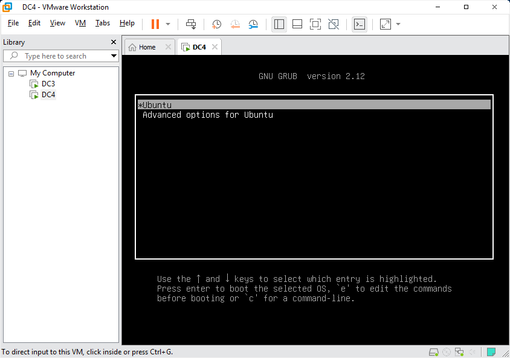
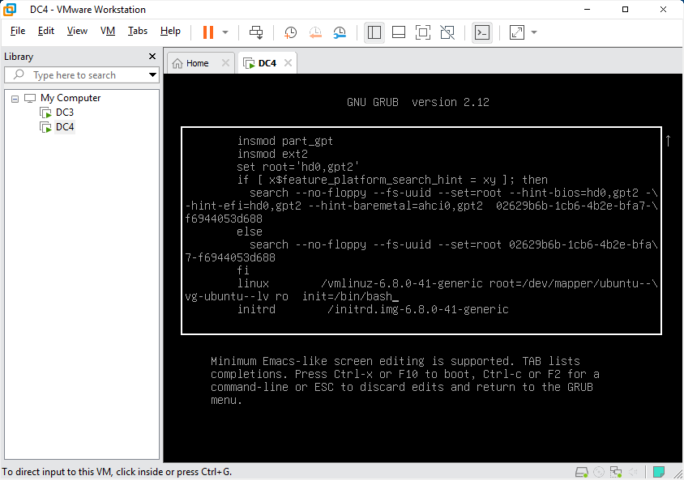
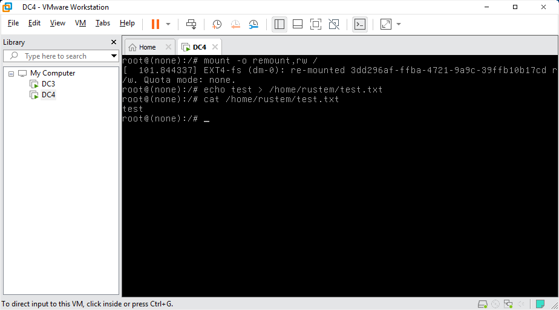
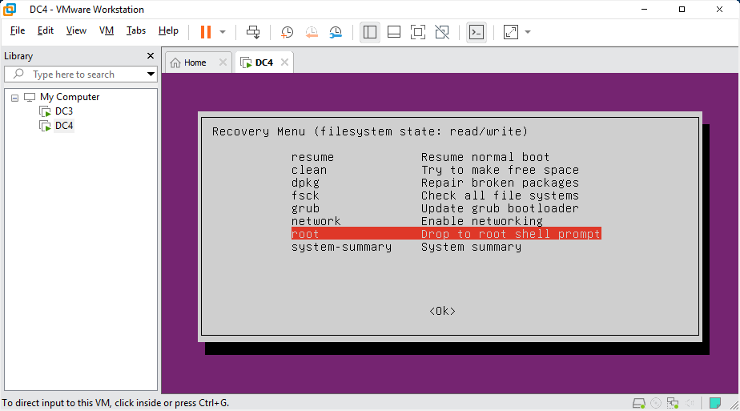
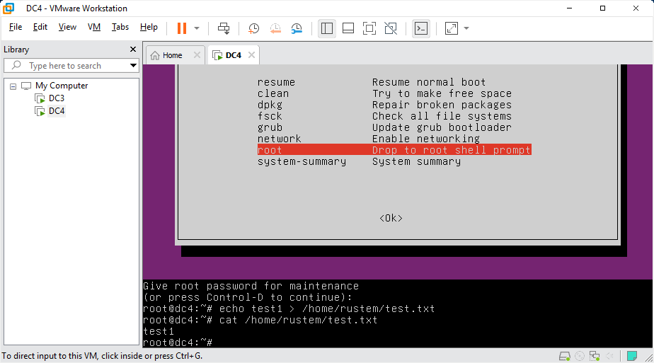
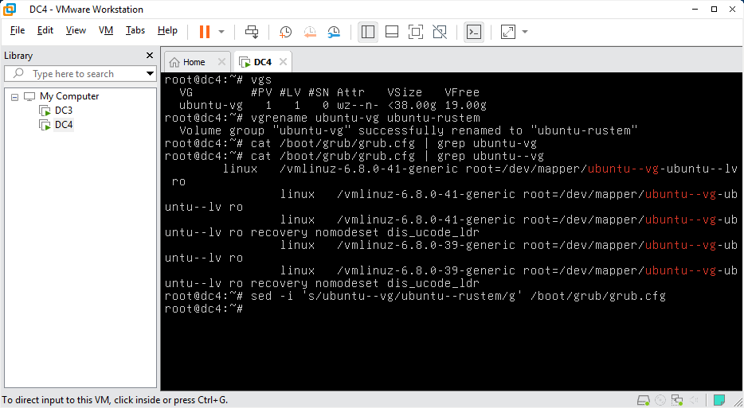
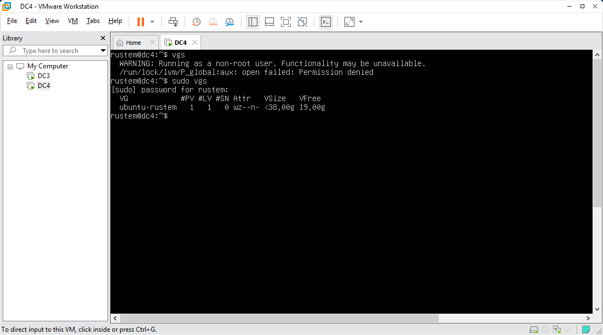

# Методическое пособие по выполнению домашнего задания по курсу «Администратор Linux. Professional»

## Задание
Включить отображение меню Grub.
Попасть в систему без пароля несколькими способами.
Установить систему с LVM, после чего переименовать VG.

## Включить отображение меню Grub
### edit /etc/default/grub config file
### comment param GRUB_TIMEOUT_STYLE=hidden
sudo sed -i 's/GRUB_TIMEOUT_STYLE=hidden/#GRUB_TIMEOUT_STYLE=hidden/' /etc/default/grub
### add delay time to param GRUB_TIMEOUT
sudo sed -i 's/GRUB_TIMEOUT=0/GRUB_TIMEOUT=10/' /etc/default/grub
### update grub config and reboot
sudo update-grub && sudo reboot

## Попасть в систему без пароля несколькими способами
### Способ 1. init=/bin/bash
at the end of line starts with linux add init=/bin/bash

### remount root filesystem in rw mode
mount -o remount,rw /

### create txt file in /home/rustem directory

## Способ 2. Recovery mode
### select item Advanced options

### select item network to remount filesystem in rw mode then select item root
### enter root password

## Установить систему с LVM, после чего переименовать VG
### get state of Volume Group
vgs  
### rename Volume Group
vgrename ubuntu-vg ubuntu-rustem  
### change old name of VG in /boot/grub/grub.cfg
sed -i 's/ubuntu--vg/ubuntu--rustem/g' /boot/grub/grub.cfg  

### reboot and get information about renamed VG
vgs  

