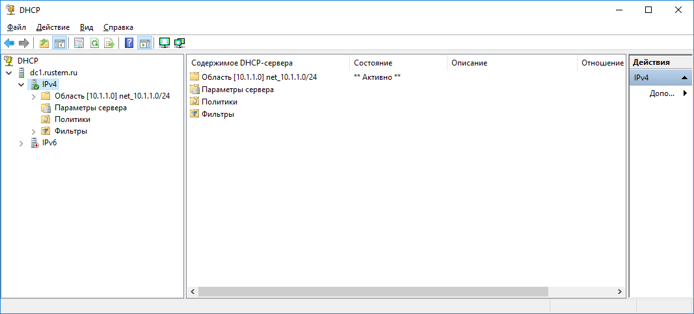

# Установка/настройка AD
## Цель:
Научиться настраивать Acеtive Directory и сопутствующие компоненты;
## Описание/Пошаговая инструкция выполнения домашнего задания:
Пошаговая инструкция  
установите службы AD, dns, dhcp на один сервер  
создайте запись A в dns testpc с ip данного сервера  
создайте пул dhcp который будет раздавать диапазон сети 10-50  

## установите службы AD, dns, dhcp на один сервер
### set static ip for server 10.1.1.2

### with powershell script install windows feature AD, DNS, DHCP  
$features = @('DHCP','DNS','AD-Domain-Services')  
foreach ($feature in $features) {   
    Install-WindowsFeature -Name $feature -IncludeManagementTools  
}  

### with powershell command configure domain rustem.ru  
Install-ADDSForest -DomainName rustem.ru -InstallDNS

## создайте запись A в dns testpc с ip данного сервера
### create reverse lookup zone with PS command  
Add-DnsServerPrimaryZone -NetworkId "10.1.1.0/24" -ReplicationScope Domain

### create A record
Add-DnsServerResourceRecordA -Name testpc -IPv4Address 10.1.1.2 -ZoneName rustem.ru -TimeToLive 01:00:00 –CreatePtr

## создайте пул dhcp который будет раздавать диапазон сети 10-50
### create new inactive scope with IP range 10.1.1.10-10.1.1.50
Add-DhcpServerv4Scope -Name “net_10.1.1.0/24” -StartRange 10.1.1.10 -EndRange 10.1.1.50 -SubnetMask 255.255.255.0 -State InActive

### set DHCP parametrs DNS-server, domain, gateway
Set-DhcpServerv4OptionValue -ScopeID 10.1.1.0 -DnsDomain rustem.ru -DnsServer 10.1.1.2 -Router 10.1.1.1

### activate DHCP scope
Set-DhcpServerv4Scope -ScopeID 10.1.1.0 -State Active

