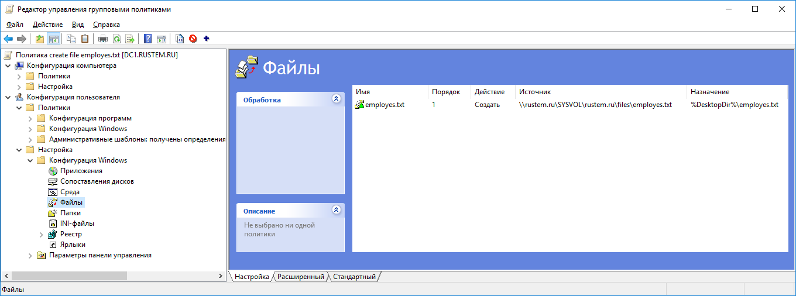
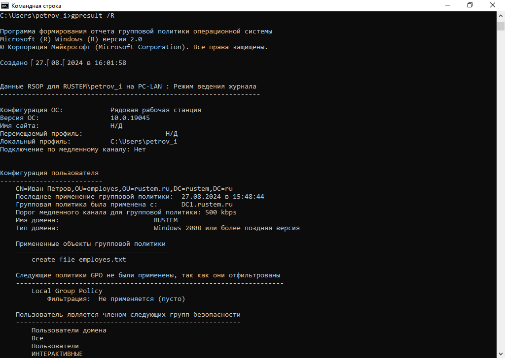

# Групповые политики

## Цель:
Настравиать и котролировать инфраструкту с помощью GPO;  
Решать рутинные задачи с помощью Powershell;

## Описание/Пошаговая инструкция выполнения домашнего задания:
Пошаговая инструкция  
создайте в оснастке ad ou employes, manager, finance по одному пользователю  
создать GPO на каждый OU указанный выше который будет создать txt файл на рабочем столе employes.manager,finance соотвествено имени OU=файл  
вывести результат gpo в cmd под любым пользователем  
вывести информацию по любому пользователю через powershell  
заблокировать всех пользоватей в ou finance с помощью powershell  

## создайте в оснастке ad ou employes, manager, finance по одному пользователю
### create ou employes, manager, finance
New-ADOrganizationalUnit -Name "rustem.ru" -Path “DC=rustem,DC=ru” –Description “main OU” -PassThru  
$ou = @('employes', 'manager', 'finance')  
$ou | foreach {New-ADOrganizationalUnit -Name $_ -Path “OU=rustem.ru,DC=rustem,DC=ru” –Description “$_ OU” -PassThru}  
### create users
New-ADUser -Name "Иван Петров" -GivenName "Иван" -Surname "Петров" -SamAccountName "petrov_i" -UserPrincipalName "petrov_i@rustem.ru" -Path "OU=employes,OU=rustem.ru,DC=rustem,DC=ru" -AccountPassword(Read-Host -AsSecureString "Input Password") -Enabled $true

New-ADUser -Name "Сергей Смирнов" -GivenName "Сергей" -Surname "Смирнов" -SamAccountName "smirnov_s" -UserPrincipalName "smirnov_s@rustem.ru" -Path "OU=finance,OU=rustem.ru,DC=rustem,DC=ru" -AccountPassword(Read-Host -AsSecureString "Input Password") -Enabled $true

New-ADUser -Name "Виталий Иванов" -GivenName "Виталий" -Surname "Иванов" -SamAccountName "ivanov_v" -UserPrincipalName "ivanov_v@rustem.ru" -Path "OU=finance,OU=rustem.ru,DC=rustem,DC=ru" -AccountPassword(Read-Host -AsSecureString "Input Password") -Enabled $true

New-ADUser -Name "Владимир Сергеев" -GivenName "Владимир" -Surname "Сергеев" -SamAccountName "sergeev_v" -UserPrincipalName "sergeev_v@rustem.ru" -Path "OU=manager,OU=rustem.ru,DC=rustem,DC=ru" -AccountPassword(Read-Host -AsSecureString "Input Password") -Enabled $true

## создать GPO на каждый OU указанный выше который будет создать txt файл на рабочем столе employes,manager,finance соотвествено имени OU=файл

## вывести результат gpo в cmd под любым пользователем

## вывести информацию по любому пользователю через powershell
PS C:\Users\Администратор.DC1> Get-ADUser -Identity petrov_i  
DistinguishedName : CN=Иван Петров,OU=employes,OU=rustem.ru,DC=rustem,DC=ru  
Enabled           : True  
GivenName         : Иван  
Name              : Иван Петров  
ObjectClass       : user  
ObjectGUID        : bedcd76c-f367-498b-9f5d-855f96078293  
SamAccountName    : petrov_i  
SID               : S-1-5-21-776038685-1899186741-688105363-1105  
Surname           : Петров  
UserPrincipalName : petrov_i@rustem.ru  

## заблокировать всех пользоватей в ou finance с помощью powershell
PS C:\Users\Администратор.DC1> Get-ADUser -SearchBase "OU=finance,OU=rustem.ru,DC=rustem,DC=ru" -Filter *

DistinguishedName : CN=Сергей Смирнов,OU=finance,OU=rustem.ru,DC=rustem,DC=ru  
Enabled           : False  
GivenName         : Сергей  
Name              : Сергей Смирнов  
ObjectClass       : user  
ObjectGUID        : 12ea97b7-a6f6-49af-bc91-20f2b2abd229  
SamAccountName    : smirnov_s  
SID               : S-1-5-21-776038685-1899186741-688105363-1106  
Surname           : Смирнов  
UserPrincipalName : smirnov_s@rustem.ru  

DistinguishedName : CN=Виталий Иванов,OU=finance,OU=rustem.ru,DC=rustem,DC=ru  
Enabled           : False  
GivenName         : Виталий  
Name              : Виталий Иванов  
ObjectClass       : user  
ObjectGUID        : 9c4cf671-d7af-41ee-9c67-b7c4680713e8  
SamAccountName    : ivanov_v  
SID               : S-1-5-21-776038685-1899186741-688105363-1107  
Surname           : Иванов  
UserPrincipalName : ivanov_v@rustem.ru  

PS C:\Users\Администратор.DC1> Get-ADUser -SearchBase "OU=finance,OU=rustem.ru,DC=rustem,DC=ru" -Filter * -Properties * | Set-ADUser -Enabled $false  
PS C:\Users\Администратор.DC1> Get-ADUser -SearchBase "OU=finance,OU=rustem.ru,DC=rustem,DC=ru" -Filter * -Properties * | select name,enabled  

name           enabled  
----           -------  
Сергей Смирнов   False  
Виталий Иванов   False  