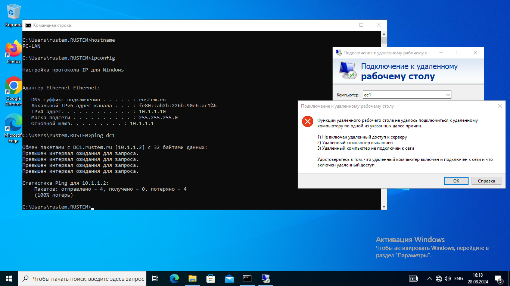

# Настройка брандмауэра

## Цель:
Контролировать доступ к серверу путем настройка Брандмауэра;

## Описание/Пошаговая инструкция выполнения домашнего задания:
Пошаговая инструкция  
включите брандмаур  
установите запрет на протокол rdp c ip локального пк  
установите запрет на ping c ip локального пк  
сделайте попытку входа и ping  
отключите правила выше  

## включите брандмаур
### by default Firewall is enabled
PS C:\Windows\system32> hostname  
DC1  

PS C:\Windows\system32> Get-NetFirewallProfile | Format-Table Name, Enabled  
Name    Enabled  
----    -------  
Domain     True  
Private    True  
Public     True  

### установите запрет на протокол rdp c ip локального пк
PS C:\Windows\system32> New-NetFirewallRule -DisplayName "DenyRDP" –RemoteAddress 10.1.1.10 -Direction Inbound -Protocol TCP –LocalPort 3389 -Action Block  
Name                  : {2a13981e-8303-47f4-b354-b9ab9fa079c0}  
DisplayName           : DenyRDP  
Description           :  
DisplayGroup          :  
Group                 :  
Enabled               : True  
Profile               : Any  
Platform              : {}  
Direction             : Inbound  
Action                : Block  
EdgeTraversalPolicy   : Block  
LooseSourceMapping    : False  
LocalOnlyMapping      : False  
Owner                 :  
PrimaryStatus         : OK  
Status                : Правило было успешно проанализировано из хранилища. (65536)  
EnforcementStatus     : NotApplicable  
PolicyStoreSource     : PersistentStore  
PolicyStoreSourceType : Local  

## установите запрет на ping c ip локального пк
PS C:\Windows\system32> New-NetFirewallRule -DisplayName "Deny inbound ICMPv4" -Direction Inbound -Protocol ICMPv4 -IcmpType 8 -RemoteAddress 10.1.1.10 -Action Block  
Name                  : {6fec2423-1526-48a2-85ef-ad0fcd8f4b28}  
DisplayName           : Deny inbound ICMPv4  
Description           :  
DisplayGroup          :  
Group                 :  
Enabled               : True  
Profile               : Any  
Platform              : {}  
Direction             : Inbound  
Action                : Block  
EdgeTraversalPolicy   : Block  
LooseSourceMapping    : False  
LocalOnlyMapping      : False  
Owner                 :  
PrimaryStatus         : OK  
Status                : Правило было успешно проанализировано из хранилища. (65536)  
EnforcementStatus     : NotApplicable  
PolicyStoreSource     : PersistentStore  
PolicyStoreSourceType : Local  

## сделайте попытку входа и ping

## отключите правила выше
PS C:\Windows\system32> Disable-NetFirewallRule –DisplayName "DenyRDP"  
PS C:\Windows\system32> Disable-NetFirewallRule –DisplayName "Deny inbound ICMPv4"  
PS C:\Windows\system32> Get-NetFirewallrule -DisplayName "DenyRDP"  
Name                  : {2a13981e-8303-47f4-b354-b9ab9fa079c0}  
DisplayName           : DenyRDP  
Enabled               : False

PS C:\Windows\system32> Get-NetFirewallrule -DisplayName "Deny inbound ICMPv4"  
Name                  : {6fec2423-1526-48a2-85ef-ad0fcd8f4b28}  
DisplayName           : Deny inbound ICMPv4  
Enabled               : False  